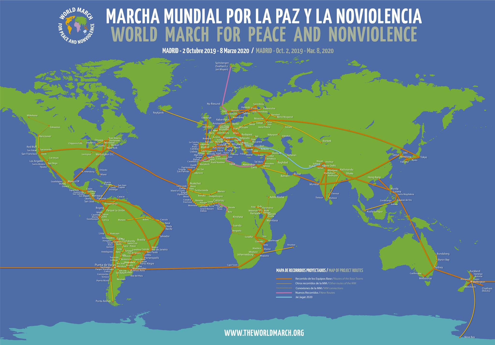

# 2ª MARCIA MONDIALE PER LA PACE E LA NONVIOLENZA - 2019-2020

## PER COSA
- **Per denunciare** la pericolosa situazione mondiale con conflitti crescenti, maggiori spese per gli armamenti mentre, allo stesso tempo, in vaste aree del pianeta molte popolazioni soffrono a causa della mancanza di cibo e acqua.
- **Continuare a creare** la consapevolezza che solo attraverso la "pace" e la "nonviolenza" la specie umana aprirà il suo futuro.
- **Rendere visibili le diverse** azioni positive che persone, collettività e popoli stanno sviluppando in numerosi luoghi in direzione dell’applicazione dei diritti umani, della non discriminazione, della collaborazione, della convivenza pacifica e della non aggressione.
- **Dare voce alle nuove generazioni** che vogliono prendere il sopravvento e lasciare il segno, installando la cultura della nonviolenza nell’immaginario collettivo, nell’educazione, nella politica, nella società... Nello stesso modo in cui in pochi anni è stata installata la coscienza ecologica.

## TEMI CENTRALI
- **Il divieto di armi nucleari.** Disarmo proporzionale e rinuncia degli Stati di usare la guerra per risolvere i conflitti o per appropriarsi delle risorse.
- _"Siamo determinati ad evitare guerre per le generazioni future"_
- **La rifondazione delle Nazioni Unite**, inclusa l’aggiunta al Consiglio per la sicurezza di un **Consiglio di sicurezza ambientale** ed un **Consiglio di sicurezza socio-economico**.
- _"Una Nazioni Unite che veglia su tutti i cittadini del pianeta"_
- **La creazione di condizioni per un pianeta integralmente sostenibile**, che tenga conto del fatto che si tratta di uno spazio limitato di cui dobbiamo assolutamente occuparci.
- _"La Terra è la casa di tutti"_
- **L’integrazione di regioni e aree con sistemi socioeconomici** al fine di garantire benessere e risorse per tutti, con l’obiettivo di eliminare la fame nel mondo nei prossimi 10 anni.
- _"Vogliamo eliminare la fame, nella storia umana”_
- **No a discriminazioni di qualsiasi tipo**: sesso, età, razza, religione, economia...
- _"Nessun essere umano al di sopra di un altro"_
- **La nonviolenza come nuova cultura e nonviolenza attiva come metodologia di azione.**
- _"La nonviolenza è la forza che trasforma il mondo"_

## QUANDO e DOVE

La 2MM inizierà a Madrid il **2 ottobre del 2019**, Giornata internazionale della nonviolenza, a dieci anni dalla 1ªMM. Partirà in direzione di Africa, Nord America, Centro e Sud, per recarsi in Oceania, viaggiando attraverso l’Asia e infine Europa, arrivando a Madrid l’**8 marzo 2020**, giorno Internazionale della Donna, dopo aver girato il pianeta in un viaggio di 159 giorni.

- EUROPA: Madrid - 02/10/2019, Cádiz - 06/10/2019
- AFRICA: Casablanca 08/10/2019, Dakar, 27/10/2019
- AMERICA: New York 28/10/2019, San José de Costa Rica 20/11/2019, Bogotá 21/11/2019, Santiago del Cile 03/01/2020,
- OCEANIA-ASIA: Wellington - 04/01/2020, New Delhi 30/1/2020
- EUROPA: Mosca 06/02/2020, Madrid 08/03/2020 (ITALIA: fine febbraio 2020)

il nuovo sito internazionale è in costruzione, intanto siamo su [www.facebook.com/MarciaMondiale/](https://www.facebook.com/MarciaMondiale/)

